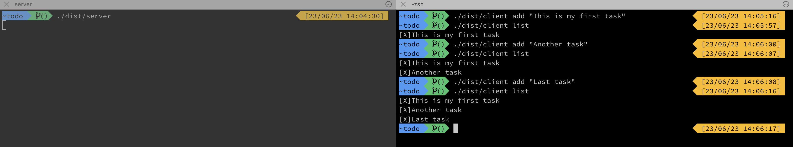

# ToDo app
It uses gRPC and protocol buffers for the server/client communication 

## Requirements
### OSX
- ``` brew install protoc-gen-go ```
- ``` brew install protoc-gen-go-grpc ```

### How to compile protocol buffers definitions files?
``` protoc -I ./todo todo.proto --go_out=./todo --go-grpc_out=require_unimplemented_servers=false:./todo ```

## How to run it
- Build the application: ``` make build ```
- Run server: ``` ./dist/server ```
- Run the client: ``` ./dist/client ```
  - The client is actually a command, so you need to specify the action you want to perform.
    Here the available commands:
    - ```list```: It returns the list of elements stored in the todo list
    - ```add```: It adds a task to the todo list

## Example

    
## Pending tasks
- Implement remove task / mark as done command